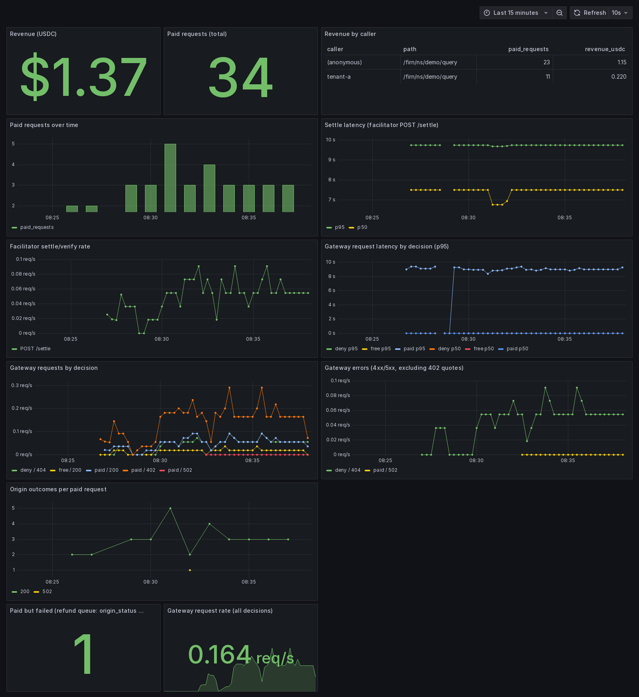
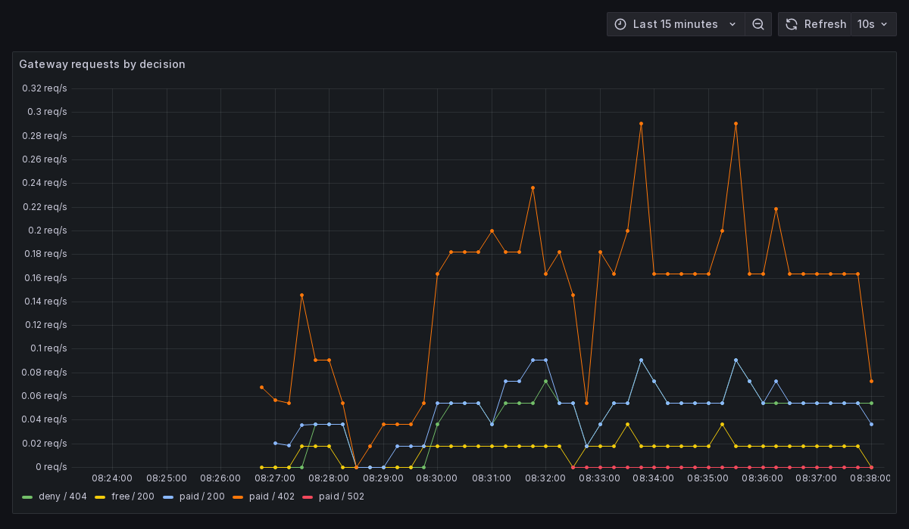

# Observability

The local stack includes an OpenTelemetry collector, Prometheus, and Grafana.
Open [the payment dashboard](http://localhost:3001/d/sluice-payments) after the demo starts.
Local Grafana permits anonymous viewing; the demo administrator password is `admin`.

The dashboard shows indexed payments, amounts, settlement latency, and gateway request counts.
Gateway metrics are available at `http://localhost:8080/metrics`.
The gateway owns this route; it is never forwarded to the origin.



These screenshots show earlier traffic on the local fork, not production transactions.
Settlement latency includes chain confirmation; it is not a measure of proxy overhead.



Pricing decisions and HTTP status distinguish quotes from completed requests:

- `paid / 402`: payment requirements returned.
- `paid / 200`: payment accepted and origin response headers returned successfully.
- `deny / 404`: no pricing rule matches the path.
- `paid / 502`: a paid request encountered an origin connection or response-header failure.

Response bodies stream after headers. A later body failure does not change the recorded status.
Receipt delivery is asynchronous and best-effort, so indexed totals can omit settled payments.
See [paid-but-failed requests](paid-but-failed.md) for the operator refund policy.

Inspect the latest receipts:

```sh
docker compose exec postgres psql -U sluice -d sluice -c \
  'SELECT tx_hash, amount_micro_usdc, origin_status, created_at FROM payments ORDER BY id DESC LIMIT 10;'
```
